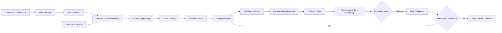

# Jambi Wind Correction MLOps

> An evolving MLOps project for short-term wind speed forecast correction in Jambi, Indonesia, using ECMWF IFS forecasts, machine learning, and a reproducible development workflow.

## Overview

`MLOps-Jambi-Wind-Correction` is a Machine Learning Operations (MLOps) project focused on improving short-term wind speed forecasts for Jambi, Indonesia.

Instead of predicting wind speed entirely from scratch, this project applies **machine-learning-based forecast correction**. Raw numerical weather prediction forecasts are obtained from ECMWF IFS, then a machine learning model learns historical forecast errors and estimates a correction for the original forecast.

The project is developed incrementally toward a complete MLOps workflow covering:

- dynamic weather data ingestion,
- data validation and forecast-reference pairing,
- feature engineering,
- model training and evaluation,
- experiment and model tracking,
- model serving,
- performance and drift monitoring,
- continuous training,
- and reproducible development infrastructure.

---

## Problem Formulation

Numerical weather prediction models such as ECMWF IFS can still contain forecast errors caused by atmospheric variability, forecast horizon, local weather characteristics, and changes in upstream model behavior.

This project formulates the problem as **supervised regression using residual correction**.

For each forecast-reference pair:

```text
residual = reference_wind_speed - forecast_wind_speed
```

The machine learning model predicts the residual:

```text
predicted_residual = ML(features)
```

The final corrected forecast is calculated as:

```text
corrected_wind = forecast_wind + predicted_residual
```

Therefore:

- a **positive residual** indicates that the raw forecast tends to underestimate the reference;
- a **negative residual** indicates that the raw forecast tends to overestimate the reference.

The current project evaluates four short-term forecast horizons:

```text
+6 hours
+12 hours
+18 hours
+24 hours
```

---

## Data Sources

### Operational Forecast

Raw forecasts are obtained from **ECMWF IFS** through the **Open-Meteo Single Runs API**.

Single Runs allow each forecast to be represented using:

- `run_time` — when the forecast model was initialized;
- `valid_time` — the time being predicted;
- `lead_time` — the forecast horizon.

The current project focuses on `wind_speed_10m` as the main forecast variable.

Additional meteorological variables can be used as model features, including:

| Feature Group | Examples |
|---|---|
| Wind | wind speed, wind direction, wind gust |
| Atmospheric | temperature, humidity, pressure |
| Weather | cloud cover, precipitation |
| Forecast metadata | lead time, run time |
| Temporal | hour and seasonal cyclical features |

### Reference Data

The current proof-of-concept uses **ECMWF IFS Analysis** as the initial reference for forecast evaluation and residual construction.

Forecast and reference data are paired using the same `valid_time`.

> **Important:** ECMWF IFS Analysis is treated as a reference for the current project stage and is **not considered independent observational ground truth**.

---

## Initial Proof-of-Concept

An initial proof-of-concept was conducted using forecast runs from:

```text
15 May 2026 → 15 August 2026
```

Forecast runs were collected at:

```text
00 UTC
06 UTC
12 UTC
18 UTC
```

for lead times:

```text
+6h
+12h
+18h
+24h
```

### Data Quality Results

```text
Forecast runs requested : 372
Successful runs         : 371
Ingestion success rate  : 99.73%

Forecast-reference rows : 1484
Valid critical rows     : 1460
Critical completeness   : 98.38%
Duplicate pairs         : 0
```

Critical forecast or reference values are not imputed. Invalid forecast-reference pairs are excluded from model evaluation.

---

## Initial ML Feasibility Test

The initial experiment compared several regression approaches:

- Linear Regression
- Random Forest
- HistGradientBoosting

A **temporal split** was used instead of random shuffling so that the model was trained on earlier observations and evaluated on later observations.

The initial Random Forest experiment produced positive MAE improvement across all evaluated lead times, with an average improvement of approximately **12.42%** compared with the raw ECMWF forecast.

The result indicates that the forecast errors contain a **learnable correction signal**.

> These results are still proof-of-concept results and should not be interpreted as final production model performance.

---

## Planned MLOps Architecture



The long-term workflow follows:

```text
ingest
  ↓
validate
  ↓
pair
  ↓
feature engineering
  ↓
train
  ↓
evaluate
  ↓
deploy
  ↓
predict
  ↓
monitor
  ↓
retrain
  ↓
validate challenger
  ↓
promote
```

---

## Planned Technology Stack

| Component | Technology |
|---|---|
| Source control | GitHub |
| Development environment | GitHub Codespaces |
| Language | Python 3.11 |
| Data processing | pandas, NumPy |
| Machine learning | scikit-learn |
| Project configuration | YAML |
| Data versioning | DVC |
| Experiment tracking | MLflow |
| Model registry | MLflow Model Registry |
| Workflow orchestration | Apache Airflow |
| Model serving | FastAPI |
| Containerization | Docker |
| CI/CD | GitHub Actions |
| Drift monitoring | Evidently / custom monitoring |
| Metrics | Prometheus |
| Dashboard | Grafana |

These components are implemented progressively as the project develops.

---

## Development Environment

The repository provides a reproducible development environment using **GitHub Codespaces** and a repository-level Dev Container configuration.

The configuration is defined in:

```text
.devcontainer/devcontainer.json
```

The environment currently provides:

- Python 3.11,
- Python VS Code extension,
- Pylance,
- Jupyter,
- YAML support,
- Ruff,
- basic Python type checking,
- format on save,
- and automatic dependency installation.

When a new Codespace is created, project dependencies are automatically installed from `requirements.txt`.

### Codespaces Validation

The current Codespaces environment has been successfully validated with:

```bash
git branch --show-current
python --version
python -m pip check
python -c "import numpy, pandas, requests, scipy, sklearn; print('LK02 Codespaces environment OK')"
```

Validation result:

```text
feat/lk02-infrastructure
Python 3.11.13
No broken requirements found.
LK02 Codespaces environment OK
```

This verifies that the project environment can be reproduced without relying on the local Windows virtual environment.

---

## Branching Strategy

The repository follows a lightweight **GitHub Flow** strategy.

The `main` branch acts as the stable integration branch. Development changes are implemented on dedicated branches before being merged through Pull Requests.

Branch naming conventions:

```text
feat/<feature-name>   → new feature or experiment
fix/<bug-name>        → bug fix
chore/<task-name>     → infrastructure or maintenance
docs/<topic-name>     → documentation
```

The LK02 infrastructure work is developed on:

```text
feat/lk02-infrastructure
```

Current workflow:

```text
main
  │
  └── feat/lk02-infrastructure
          │
          ├── standardized directory structure
          ├── Codespaces configuration
          ├── project configuration
          ├── environment validation
          ├── MIT License
          └── README documentation
                  │
                  ▼
             Pull Request
                  │
               review
                  │
             validation
                  │
                  ▼
                main
```

Changes are merged into `main` only after validation.

---

## Repository Structure

```text
MLOps-Jambi-Wind-Correction/
│
├── .devcontainer/
│   └── devcontainer.json
│
├── config/
│   └── project.yaml
│
├── data/
│   ├── raw/
│   ├── interim/
│   ├── processed/
│   └── reports/
│
├── docs/
├── models/
├── notebooks/
│
├── src/
│   ├── __init__.py
│   │
│   ├── data/
│   │   ├── __init__.py
│   │   ├── test_single_run.py
│   │   ├── test_reference.py
│   │   └── build_poc_dataset.py
│   │
│   ├── features/
│   │   └── __init__.py
│   │
│   ├── models/
│   │   ├── __init__.py
│   │   └── sanity_residual_correction.py
│   │
│   └── monitoring/
│       └── __init__.py
│
├── tests/
│   └── __init__.py
│
├── .gitignore
├── LICENSE
├── README.md
└── requirements.txt
```

### Directory Responsibilities

| Directory | Purpose |
|---|---|
| `.devcontainer/` | Reproducible Codespaces environment |
| `config/` | Centralized project configuration |
| `data/raw/` | Raw data obtained from upstream sources |
| `data/interim/` | Intermediate transformation results |
| `data/processed/` | Cleaned or modeling-ready data |
| `data/reports/` | Data-quality and evaluation reports |
| `docs/` | Project documentation |
| `models/` | Trained model artifacts |
| `notebooks/` | Exploratory analysis and experiments |
| `src/data/` | Data ingestion, validation, and pairing |
| `src/features/` | Feature engineering logic |
| `src/models/` | Model training and evaluation |
| `src/monitoring/` | Monitoring and drift logic |
| `tests/` | Automated project tests |

---

## Project Configuration

Project-level parameters are centralized in:

```text
config/project.yaml
```

The current configuration stores:

- project name,
- Jambi location,
- latitude and longitude,
- timezone,
- forecast source,
- target variable,
- forecast lead times,
- reference source,
- and machine learning task definition.

Separating configuration from source code reduces hard-coded project parameters and makes future changes easier to manage.

---

## Current Development Status

| Stage | Status |
|---|---|
| Problem formulation | ✅ Completed |
| ECMWF IFS Single Runs validation | ✅ Completed |
| IFS Analysis reference validation | ✅ Completed |
| Forecast-reference pairing | ✅ Completed |
| Data-quality validation | ✅ Completed |
| Raw forecast baseline | ✅ Completed |
| Temporal residual-correction PoC | ✅ Completed |
| Standardized repository structure | ✅ Completed |
| Project configuration | ✅ Completed |
| GitHub Codespaces setup | ✅ Completed |
| Codespaces dependency validation | ✅ Completed |
| GitHub Flow infrastructure branch | ✅ Completed |
| MIT License | ✅ Completed |
| LK02 Pull Request | ✅ Completed |
| DVC data versioning | ⏳ Planned |
| MLflow experiment tracking | ⏳ Planned |
| Production model training | ⏳ Planned |
| Model serving | ⏳ Planned |
| CI/CD automation | ⏳ Planned |
| Drift monitoring | ⏳ Planned |
| Prometheus & Grafana monitoring | ⏳ Planned |
| Automated continuous training | ⏳ Planned |

---

## Getting Started

There are two supported ways to work with this repository:

1. GitHub Codespaces
2. Local Python environment

### Option 1 — GitHub Codespaces

Open the repository on GitHub and select:

```text
Code
→ Codespaces
→ Create codespace
```

The Dev Container automatically configures the environment and installs dependencies from `requirements.txt`.

Verify the environment:

```bash
python --version
python -m pip check
```

Optional dependency validation:

```bash
python -c "import numpy, pandas, requests, scipy, sklearn; print('Dependencies OK')"
```

### Option 2 — Local Development

Clone the repository:

```bash
git clone https://github.com/farlliant/MLOps-Jambi-Wind-Correction.git
cd MLOps-Jambi-Wind-Correction
```

Create a virtual environment:

```bash
python -m venv .venv
```

Activate it on Windows PowerShell:

```powershell
.\.venv\Scripts\Activate.ps1
```

Install dependencies:

```bash
python -m pip install -r requirements.txt
```

---

## Running the Current Proof-of-Concept

### Validate ECMWF IFS Single Runs

```bash
python src/data/test_single_run.py
```

### Validate Reference Data

```bash
python src/data/test_reference.py
```

### Build Forecast-Reference Dataset

```bash
python src/data/build_poc_dataset.py
```

### Run Residual-Correction Sanity Test

```bash
python src/models/sanity_residual_correction.py
```

---

## Data Versioning Policy

Generated datasets are intentionally excluded from normal Git versioning.

Current generated data locations include:

```text
data/raw/
data/processed/
data/reports/
```

The directory structure is retained using `.gitkeep`, while generated files are excluded through `.gitignore`.

As the project progresses, reproducible datasets are planned to be managed using **DVC** rather than committed directly to the Git repository.

---

## Continuous Training Strategy

The project is designed around a **hybrid continuous-training strategy**.

Retraining can eventually be triggered by:

1. scheduled evaluation,
2. model performance degradation,
3. persistent data or feature drift.

Retraining does not automatically replace the deployed model.

A newly trained model acts as a **challenger**, while the currently deployed model remains the **champion**.

```text
current champion
      │
      ├───────────────┐
      │               │
      ▼               ▼
continue serving   train challenger
                       │
                       ▼
                  evaluate model
                       │
             ┌─────────┴─────────┐
             │                   │
          better?              worse?
             │                   │
             ▼                   ▼
      promote challenger    keep champion
```

---

## Evaluation Metrics

The main model metrics are:

- **MAE** — Mean Absolute Error
- **RMSE** — Root Mean Squared Error
- **Bias** — average directional forecast error

A corrected model is expected to satisfy:

```text
MAE_corrected < MAE_raw
RMSE_corrected <= RMSE_raw
|Bias_corrected| <= |Bias_raw|
```

Evaluation is performed per forecast lead time as well as across the overall dataset.

Pipeline-level monitoring will also include:

- ingestion success,
- critical data completeness,
- duplicate detection,
- data freshness,
- pipeline execution status.

---

## Project Direction

The repository is currently transitioning from the **initial proof-of-concept** into a structured MLOps implementation.

The next major milestones are:

1. introduce reproducible dataset versioning,
2. organize experiment tracking,
3. formalize model training and validation,
4. register champion and challenger models,
5. package the inference service,
6. automate CI/CD,
7. monitor system and model health,
8. detect drift and performance degradation,
9. trigger challenger training,
10. deploy validated model improvements.

---

## License

This project is licensed under the **MIT License**.

See the `LICENSE` file for details.

---

## Disclaimer

ECMWF IFS Analysis is currently used as an initial reference for the proof-of-concept and is **not treated as independent observational ground truth**.

The project architecture and technology stack will continue to evolve as subsequent MLOps stages are implemented.
