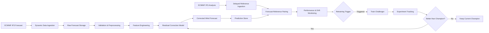

# Jambi Wind Correction MLOps

> An end-to-end MLOps project for short-term wind speed forecast correction in Jambi, Indonesia, using ECMWF IFS forecasts, dynamic data ingestion, and machine learning.

---

## Overview

`MLOps-Jambi-Wind-Correction` is an evolving Machine Learning Operations (MLOps) project focused on improving short-term wind speed forecasts for Jambi, Indonesia.

Instead of predicting wind speed entirely from scratch, the project applies **machine-learning-based residual correction** to numerical weather prediction forecasts.

A raw ECMWF IFS forecast is first collected. Historical forecast errors are then modeled as residuals so that a machine learning model can estimate a correction for future forecasts.

Conceptually:

```text
raw forecast
     ↓
estimate forecast error
     ↓
predicted residual
     ↓
corrected forecast
```

The correction formulation is:

```text
residual = reference_wind_speed - forecast_wind_speed

predicted_residual = ML(features)

corrected_wind = forecast_wind + predicted_residual
```

The current project focuses on the following short-term forecast horizons:

```text
+6 hours
+12 hours
+18 hours
+24 hours
```

The long-term goal is to develop a reproducible MLOps system covering:

- dynamic data ingestion,
- automated preprocessing and validation,
- feature engineering,
- forecast-reference pairing,
- dataset versioning,
- model training and experiment tracking,
- model registry,
- model serving,
- drift and performance monitoring,
- continuous training,
- and automated model delivery.

---

## Problem Formulation

Numerical weather prediction models such as ECMWF IFS can still contain forecast errors caused by atmospheric variability, local weather characteristics, forecast horizon, seasonality, and changes in the upstream model.

Rather than replacing the numerical weather model, this project treats machine learning as a **post-processing correction layer**.

For every forecast-reference pair:

```text
residual = reference - forecast
```

A machine learning model is trained to predict this residual from forecast variables and metadata.

The final prediction becomes:

```text
corrected forecast = raw forecast + predicted residual
```

A positive residual means the original forecast underestimated the reference value, while a negative residual means the forecast overestimated it.

This formulation allows the project to retain the physical information provided by ECMWF while learning systematic forecast errors from historical data.

---

## Data Sources

### Operational Forecast

Operational forecast data is obtained from:

**ECMWF IFS via the Open-Meteo Single Runs API**

Project location:

```text
Location  : Jambi, Indonesia
Latitude  : -1.633333
Longitude : 103.650000
Timezone  : Asia/Jakarta
```

The project currently retrieves the following meteorological variables:

| Variable | Description |
|---|---|
| `wind_speed_10m` | Wind speed at 10 meters |
| `wind_direction_10m` | Wind direction at 10 meters |
| `wind_gusts_10m` | Wind gust speed |
| `temperature_2m` | Air temperature at 2 meters |
| `relative_humidity_2m` | Relative humidity |
| `pressure_msl` | Mean sea-level pressure |
| `cloud_cover` | Total cloud cover |
| `precipitation` | Precipitation |

Each raw forecast snapshot also stores provenance metadata:

```text
run_time
valid_time
retrieved_at
source
```

The forecast initialization cycles used by the project are:

```text
00 UTC
06 UTC
12 UTC
18 UTC
```

### Reference Data

The current proof-of-concept uses **ECMWF IFS Analysis** as the forecast reference.

Forecast data and reference data are paired using the corresponding `valid_time`.

> **Important:** ECMWF IFS Analysis is used as a reference / proxy target for the current project stage and is not treated as independent observational ground truth.

The reference is naturally delayed relative to a newly initialized forecast. Therefore, operational forecast ingestion and reference-based evaluation are treated as separate stages.

---

## Initial Feasibility Study

Before expanding the project into a complete MLOps workflow, an initial feasibility study was conducted using ECMWF forecast runs from:

```text
15 May 2026 → 15 August 2026
```

Forecast initialization cycles:

```text
00 UTC
06 UTC
12 UTC
18 UTC
```

Evaluated forecast horizons:

```text
+6h
+12h
+18h
+24h
```

### Data Quality Results

```text
Forecast runs requested : 372
Successful runs         : 371
Ingestion success rate  : 99.73%

Forecast-reference rows : 1484
Valid critical rows     : 1460
Critical completeness   : 98.38%
Duplicate pairs         : 0
```

Critical forecast-reference values were not blindly imputed. Invalid critical pairs were excluded from the evaluation dataset.

### Initial Model Experiment

The initial residual-correction experiment evaluated:

- Linear Regression
- Random Forest
- HistGradientBoosting

A **temporal train-test split** was used instead of random shuffling so that earlier observations were used for training and later observations were used for evaluation.

The initial Random Forest experiment produced an average MAE improvement of approximately:

```text
12.42%
```

compared with the raw ECMWF forecast.

The feasibility study indicates that forecast errors contain a **learnable correction signal**.

> These results are proof-of-concept results and should not be interpreted as final production model performance.

---

## MLOps Architecture

The target system is designed around a separation between operational forecasting, delayed reference collection, machine learning, and monitoring.


```mermaid
flowchart LR
    A[ECMWF IFS Forecast] --> B[Dynamic Data Ingestion]
    B --> C[Raw Forecast Storage]
    C --> D[Validation & Preprocessing]
    D --> E[Feature Engineering]

    E --> F[Residual Correction Model]
    F --> G[Corrected Wind Forecast]
    G --> H[Prediction Store]

    R[ECMWF IFS Analysis] --> I[Delayed Reference Ingestion]
    I --> J[Forecast-Reference Pairing]
    H --> J

    J --> K[Performance & Drift Monitoring]
    K --> L{Retraining Trigger}

    L -->|Triggered| M[Train Challenger]
    M --> N[Experiment Tracking]
    N --> O{Better than Champion?}

    O -->|Yes| F
    O -->|No| P[Keep Current Champion]
```

The long-term workflow is:

```text
forecast ingestion
        ↓
validation
        ↓
preprocessing
        ↓
feature engineering
        ↓
prediction
        ↓
reference arrival
        ↓
forecast-reference pairing
        ↓
performance evaluation
        ↓
drift monitoring
        ↓
retraining trigger
        ↓
challenger training
        ↓
champion validation
        ↓
deployment
```

---

## Development Environment

The repository provides a reproducible development environment using **GitHub Codespaces** and a repository-level Dev Container configuration.

The environment is defined in:

```text
.devcontainer/devcontainer.json
```

The current development environment uses:

- Python 3.11
- pandas
- NumPy
- Requests
- scikit-learn
- GitHub Codespaces
- GitHub Actions

Install project dependencies with:

```bash
python -m pip install -r requirements.txt
```

Validate the Python environment:

```bash
python --version
python -m pip check
```

The current project has been validated with Python 3.11.

Source-code syntax can be checked using:

```bash
python -m py_compile \
  src/ingest_data.py \
  src/preprocess.py
```

Code quality can also be checked using Ruff:

```bash
ruff check \
  src/ingest_data.py \
  src/preprocess.py
```

---

## Branching Strategy

The repository follows a lightweight **GitHub Flow** strategy.

The `main` branch acts as the stable integration branch.

New development work is performed on dedicated branches and merged through Pull Requests after validation.

Branch naming convention:

```text
feat/<feature-name>   → new feature
fix/<bug-name>        → bug fix
chore/<task-name>     → infrastructure or maintenance
docs/<topic-name>     → documentation
```

Typical workflow:

```text
main
 │
 └── feature branch
          │
          ├── implementation
          ├── local validation
          ├── commit
          └── push
                  │
                  ▼
             Pull Request
                  │
          automated validation
                  │
                  ▼
                main
```

---

## Repository Structure

The repository currently follows the structure below:

```text
MLOps-Jambi-Wind-Correction/
│
├── .devcontainer/
│   └── devcontainer.json
│
├── .github/
│   └── workflows/
│       └── lk04-data-pipeline.yml
│
├── config/
│   └── project.yaml
│
├── data/
│   ├── raw/
│   │   └── samples/
│   │       └── forecast_sample.csv
│   │
│   ├── interim/
│   ├── processed/
│   └── reports/
│
├── docs/
├── models/
├── notebooks/
│
├── src/
│   ├── ingest_data.py
│   ├── preprocess.py
│   │
│   ├── data/
│   │   ├── build_poc_dataset.py
│   │   ├── lk03_pipeline_preview.py
│   │   ├── test_reference.py
│   │   └── test_single_run.py
│   │
│   ├── features/
│   ├── models/
│   └── monitoring/
│
├── tests/
│
├── .gitignore
├── LICENSE
├── README.md
└── requirements.txt
```

Generated operational datasets are intentionally excluded from normal Git commits.

A small representative raw sample is retained at:

```text
data/raw/samples/forecast_sample.csv
```

for documentation and reproducibility.

---

## Running the Data Pipeline

The current implementation provides dynamic forecast ingestion, automated preprocessing, data-quality validation, and scheduled execution through GitHub Actions.

The operational flow is:

```text
ECMWF IFS / Open-Meteo
          ↓
Dynamic Forecast Ingestion
          ↓
Raw Forecast Snapshot
          ↓
Automated Preprocessing
          ↓
Processed Forecast Dataset
          ↓
Data Quality Report
```

---

### Dynamic ECMWF Forecast Ingestion

Forecast ingestion is implemented in:

```text
src/ingest_data.py
```

Run the collector without arguments:

```bash
python src/ingest_data.py
```

The ingestion script automatically:

- determines candidate ECMWF forecast runs,
- checks the newest candidate first,
- falls back to an earlier model run when the newest one is unavailable,
- handles transient request errors using retry logic,
- validates the upstream response,
- adds ingestion metadata,
- and stores a timestamped raw forecast snapshot.

A typical generated raw file is:

```text
data/raw/single_runs/20260928T00.csv
```

Each model run receives a different filename based on its initialization time.

This prevents newly collected runs from destructively overwriting earlier snapshots.

---

### Deterministic Historical Ingestion

A specific model run can be requested explicitly:

```bash
python src/ingest_data.py \
  --run-time 2026-08-18T00:00
```

This execution mode is useful for:

- reproducible testing,
- historical validation,
- debugging,
- and periodic-ingestion simulation.

---

### Periodic Ingestion Safety

The ingestion process is designed to behave safely when executed repeatedly in a persistent environment.

If a forecast snapshot for the requested `run_time` already exists:

```text
existing snapshot detected
        ↓
duplicate download skipped
```

For example:

```bash
python src/ingest_data.py \
  --run-time 2026-08-18T06:00
```

When the corresponding raw file already exists, the script returns the existing snapshot rather than destructively replacing it.

Conceptually:

```text
first execution
      ↓
forecast run fetched
      ↓
snapshot saved

second execution
      ↓
same run requested
      ↓
existing snapshot found
      ↓
duplicate ingestion skipped
```

---

### Raw Forecast Data

The raw layer preserves upstream meteorological variables before the main preprocessing transformations.

A raw snapshot contains variables such as:

```text
wind_speed_10m
wind_direction_10m
wind_gusts_10m
temperature_2m
relative_humidity_2m
pressure_msl
cloud_cover
precipitation
```

and ingestion metadata:

```text
run_time
valid_time
retrieved_at
source
```

The raw layer intentionally remains close to the upstream API response.

Forecast-horizon selection and feature engineering are performed during preprocessing.

---

### Forecast Preprocessing

Automated preprocessing is implemented in:

```text
src/preprocess.py
```

Process the latest locally available raw forecast snapshot:

```bash
python src/preprocess.py
```

A specific raw snapshot can also be provided:

```bash
python src/preprocess.py \
  --input data/raw/single_runs/20260818T00.csv
```

The preprocessing pipeline performs:

```text
raw forecast
      ↓
schema validation
      ↓
datatype normalization
      ↓
UTC timestamp normalization
      ↓
forecast lead calculation
      ↓
target-horizon selection
      ↓
duplicate handling
      ↓
critical missing-value handling
      ↓
physical-range validation
      ↓
cyclical feature engineering
      ↓
processed forecast dataset
      ↓
data-quality report
```

The current modeling scope selects:

```text
+6h
+12h
+18h
+24h
```

---

### Data Validation

The preprocessing stage performs explicit schema and data-quality checks.

Current physical validation includes:

```text
wind_speed_10m >= 0

0 <= wind_direction_10m <= 360

0 <= relative_humidity_2m <= 100

0 <= cloud_cover <= 100

precipitation >= 0
```

Critical wind variables are explicitly checked for missing values.

Rows that do not satisfy the current critical preprocessing requirements are excluded from the final processed dataset.

---

### Generated Features

Wind direction is a circular variable.

For example:

```text
359° ≈ 1°
```

although their raw numeric values appear far apart.

The pipeline therefore creates:

```text
wind_direction_sin
wind_direction_cos
```

Temporal variables are also encoded cyclically.

Generated temporal features include:

```text
hour_sin
hour_cos
day_of_year_sin
day_of_year_cos
```

Canonical timestamps remain stored in UTC.

Local temporal features are derived using:

```text
Asia/Jakarta
```

so that the resulting features reflect the local daily and seasonal cycle in Jambi.

---

### Processed Forecast Data

Processed datasets are written to:

```text
data/processed/
```

A typical output file is:

```text
forecast_20260818T00_processed.csv
```

For one forecast run, the current configuration normally produces four target rows:

```text
lead_hours
-----------
6
12
18
24
```

---

### Data Quality Reporting

Each preprocessing execution also generates a quality report in:

```text
data/reports/
```

A typical report file is:

```text
forecast_20260818T00_quality.csv
```

The report records:

- raw row count,
- selected lead rows,
- invalid timestamp rows,
- duplicate rows,
- missing critical rows,
- physically invalid rows,
- processed row count,
- and completeness percentage.

One validated historical execution produced:

```text
Raw rows               : 30
Target lead rows       : 4
Duplicate rows         : 0
Missing critical rows  : 0
Invalid physical rows  : 0
Processed rows         : 4
Completeness           : 100.00%
```

The reported completeness value refers to rows satisfying the current critical preprocessing requirements.

---

## Workflow Automation

The current data pipeline is automated using **GitHub Actions**.

The workflow is defined in:

```text
.github/workflows/lk04-data-pipeline.yml
```

The workflow supports:

- validation on Pull Requests,
- manual execution using `workflow_dispatch`,
- scheduled execution,
- Python environment setup,
- dependency installation,
- source-code validation,
- dynamic ingestion,
- automated preprocessing,
- generated-output inspection,
- and artifact upload.

The automated execution flow is:

```text
GitHub Actions
      ↓
Checkout Repository
      ↓
Set Up Python
      ↓
Install Dependencies
      ↓
Validate Scripts
      ↓
Dynamic Ingestion
      ↓
Automated Preprocessing
      ↓
Upload Pipeline Outputs
```

The workflow is scheduled using:

```text
every 3 hours
```

This represents a **polling interval**, not the ECMWF model-generation frequency.

The ingestion script independently determines which ECMWF forecast run is currently available.

Workflow execution has been validated successfully through both Pull Request execution and manual execution from the `main` branch.

Generated pipeline outputs are stored as GitHub Actions artifacts.

> GitHub Actions artifacts represent outputs from individual workflow executions. They are not a replacement for formal dataset versioning using DVC.

---

## Data Storage and Versioning Policy

Generated operational datasets are intentionally excluded from normal Git versioning.

Current generated-data locations include:

```text
data/raw/single_runs/
data/interim/
data/processed/
data/reports/
```

A representative raw sample is retained in Git:

```text
data/raw/samples/forecast_sample.csv
```

This allows the repository to document the expected raw schema without committing continuously generated operational datasets.

Formal dataset versioning is planned using **DVC**.

The intended separation is:

```text
Git
→ source-code versioning

Raw snapshots
→ non-destructive operational data

GitHub Actions artifacts
→ workflow execution outputs

DVC
→ formal dataset versioning
```

---

## Continuous Training Strategy

The project is designed around a **hybrid continuous-training strategy**.

Future challenger training may be triggered by:

1. scheduled evaluation,
2. persistent model-performance degradation,
3. persistent data or feature drift.

Retraining does not automatically replace the deployed model.

A newly trained model acts as a **challenger**, while the current production model remains the **champion**.

```text
Current Champion
       ↓
Monitor Performance / Drift
       ↓
Retraining Trigger
       ↓
Train Challenger
       ↓
Evaluate Challenger
       ↓
Better than Champion?
      /           \
    yes            no
     ↓              ↓
 promote         keep champion
```

Only a challenger that satisfies the model acceptance criteria should be promoted.

---

## Monitoring Strategy

The future production system is designed to monitor three major areas.

### Model Performance

Planned model-level metrics include:

- rolling MAE,
- rolling RMSE,
- rolling bias,
- raw forecast vs corrected forecast performance,
- performance by forecast horizon.

### Data Health

Planned data-health monitoring includes:

- schema validity,
- critical missing values,
- physical value ranges,
- data freshness,
- duplicate detection,
- feature drift,
- prediction drift.

### Pipeline and Service Health

Planned operational monitoring includes:

- ingestion success,
- workflow failures,
- pipeline execution time,
- prediction requests,
- prediction errors,
- inference latency.

Prometheus is planned for operational metrics collection, while Grafana is planned for dashboard visualization.

---

## Current Development Status

| Capability | Status |
|---|---|
| Problem formulation | ✅ Completed |
| Forecast datasource validation | ✅ Completed |
| Reference datasource validation | ✅ Completed |
| Historical forecast-reference feasibility | ✅ Completed |
| Residual-correction feasibility | ✅ Completed |
| Reproducible repository environment | ✅ Completed |
| GitHub Codespaces setup | ✅ Completed |
| Dynamic ECMWF forecast ingestion | ✅ Implemented |
| Latest-run detection and fallback | ✅ Implemented |
| Connection retry handling | ✅ Implemented |
| Non-destructive forecast snapshots | ✅ Implemented |
| Automated forecast preprocessing | ✅ Implemented |
| Data-quality validation | ✅ Implemented |
| Cyclical feature engineering | ✅ Implemented |
| Data-quality reporting | ✅ Implemented |
| Representative raw sample | ✅ Implemented |
| GitHub Actions workflow automation | ✅ Implemented |
| Pull Request pipeline validation | ✅ Validated |
| Manual workflow execution | ✅ Validated |
| Formal forecast-reference training dataset | ⏳ Planned |
| DVC dataset versioning | ⏳ Planned |
| MLflow experiment tracking | ⏳ Planned |
| Model registry | ⏳ Planned |
| Production model training | ⏳ Planned |
| Model serving | ⏳ Planned |
| Drift monitoring | ⏳ Planned |
| Prometheus & Grafana monitoring | ⏳ Planned |
| Automated continuous training | ⏳ Planned |

---

## Planned Technology Stack

| Component | Technology |
|---|---|
| Source control | GitHub |
| Development environment | GitHub Codespaces |
| Language | Python |
| Data processing | pandas / NumPy |
| Machine learning | scikit-learn |
| Workflow automation | GitHub Actions |
| Data versioning | DVC |
| Experiment tracking | MLflow |
| Model registry | MLflow Model Registry |
| Workflow orchestration | Apache Airflow |
| Model serving | FastAPI |
| Containerization | Docker |
| Drift monitoring | Evidently / custom monitoring |
| Metrics | Prometheus |
| Dashboard | Grafana |

GitHub Actions currently provides lightweight automation for the data pipeline.

Apache Airflow remains planned for future workflows involving more complex task dependencies such as:

```text
ingestion
→ reference refresh
→ preprocessing
→ dataset construction
→ training
→ evaluation
→ model registration
→ deployment
→ monitoring
→ retraining
```

---

## Project Direction

The repository has progressed from datasource feasibility and residual-correction experiments into the first operational implementation of the data pipeline.

The following capabilities are already available:

```text
forecast datasource validation
        ↓
historical feasibility
        ↓
dynamic forecast ingestion
        ↓
latest-run fallback
        ↓
automated preprocessing
        ↓
data-quality validation
        ↓
feature engineering
        ↓
workflow automation
```

The next major milestones are:

1. construct the final forecast-reference training dataset,
2. introduce reproducible dataset versioning using DVC,
3. track experiments using MLflow,
4. formalize production-oriented model training,
5. register champion and challenger models,
6. package the inference service,
7. expand workflow orchestration as pipeline complexity grows,
8. monitor data, model, and service health,
9. detect performance degradation and drift,
10. trigger challenger training,
11. validate challengers against the current champion,
12. deploy validated model improvements.

The long-term objective is a reproducible MLOps system capable of:

```text
fetch
  ↓
validate
  ↓
preprocess
  ↓
version
  ↓
train
  ↓
evaluate
  ↓
serve
  ↓
observe
  ↓
monitor
  ↓
retrain
  ↓
promote
```

while keeping source code, datasets, experiments, model artifacts, and pipeline behavior reproducible.

---

## License

This project is licensed under the **MIT License**.

See the `LICENSE` file for details.

---

## Disclaimer

ECMWF IFS Analysis is currently used as an initial forecast reference and is **not treated as independent observational ground truth**.

The project architecture and technology stack will continue to evolve as additional MLOps capabilities are implemented.